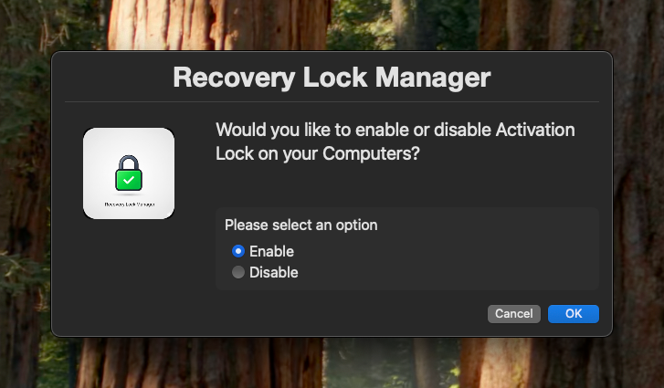
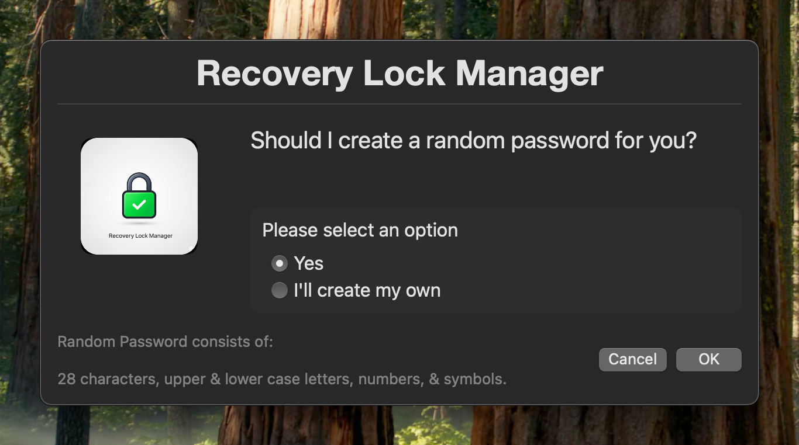
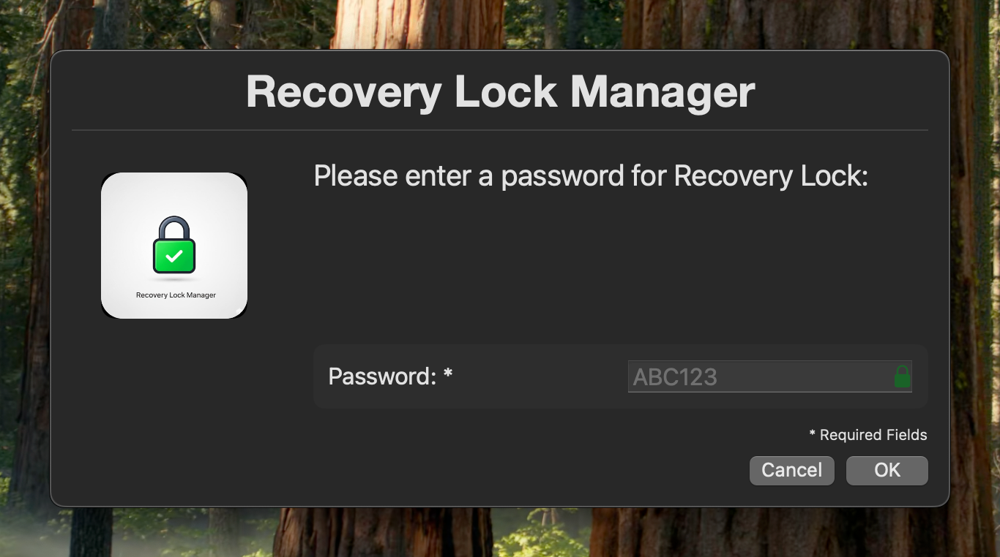
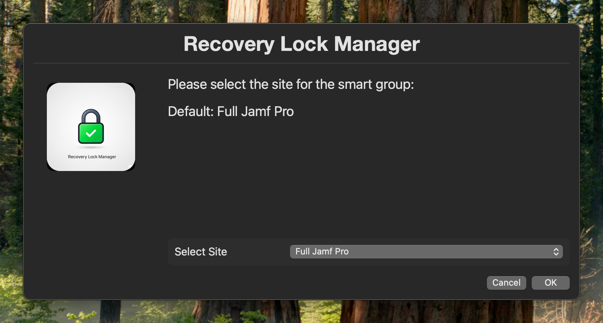
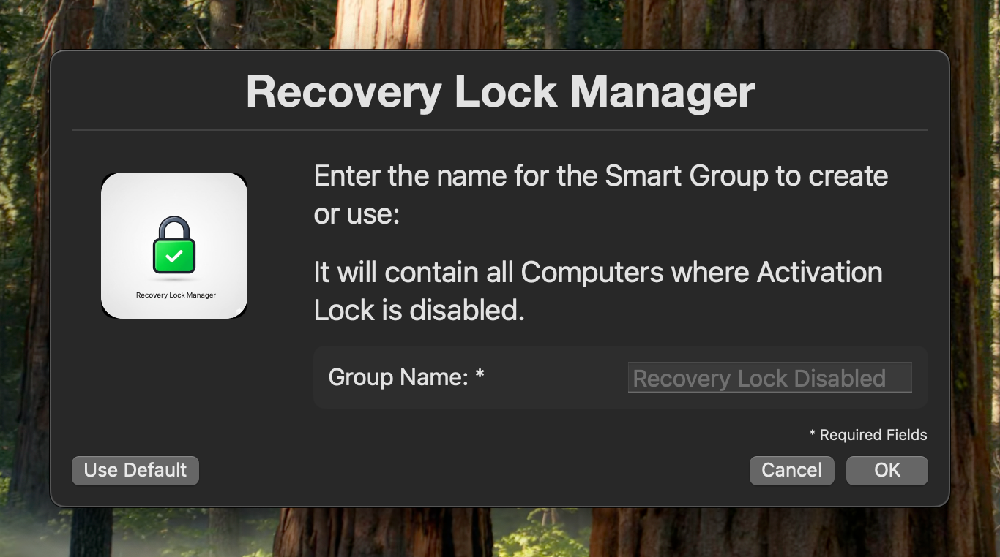
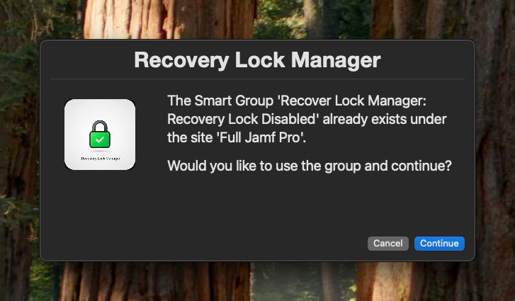
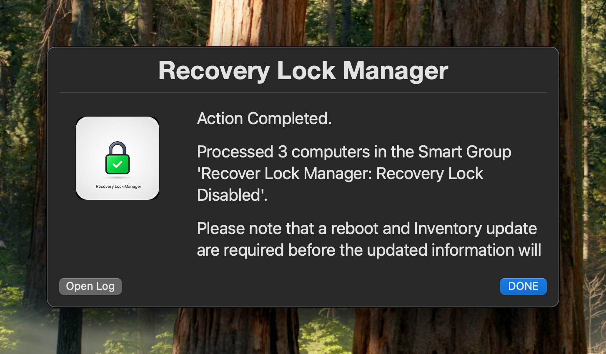

# Recovery-Lock-Manager
---


This tool helps manage Recovery Lock on macOS devices enrolled in Jamf Pro.
The UI is built using [Swift Dialog](https://github.com/swiftDialog/swiftDialog).
It leverages the Jamf Pro API to identify devices without Recovery Lock enabled and activates it on those devices.
The script creates a Smart Group in Jamf Pro to identify these devices and then enables / disables Recovery Lock as needed.
## Features
- Provides a user-friendly interface using Swift Dialog.
- Identifies macOS devices without Recovery Lock enabled / disabled.
- Creates a Smart Group in Jamf Pro.
- Enables / disables Recovery Lock on identified devices.
- Handles API authentication and token management.
- Supports site selection for organizations using sites in Jamf Pro.
- Logs actions and errors for troubleshooting.
- Prompts for user confirmation before proceeding with actions.
- Allows reusing existing Smart Groups if they already exist.
- Prompts for Jamf Pro API credentials with option to use environment variables.
- Customizable variables for easy configuration.
- Error handling and user feedback through dialog boxes.












## Requirements
- Access to the Jamf Pro API
- Jamf Pro API credentials (client ID and client secret)
- Desired Group Name
- jq (JSON processor)
- bash (or compatible shell)
- macOS devices enrolled in Jamf Pro
- Internet connection
  

## Require Permissions for API Client
- Read Advanced Computer Searches
- Send Set Recovery Lock Command
- Read Smart Computer Groups
- Update Smart Computer Groups
- Create Smart Computer Groups
- View MDM command information in Jamf Pro API
- Read Computers
- Read Sites

## Usage
> [!CAUTION]
> Observations showed that with current version of Jamf Pro, when sending a recovery lock command through the Jamf Pro API, the password will **stop rotating** automatically even if configured to do so in the prestage settings. I will provide an update and report it here if this changes in future versions of Jamf Pro.


1. Clone the repository or download the script.
2. Open the script in a text editor.
3. (optional) Update the variables at the top of the script.
   1. If you want to be prompted for your Jamf Pro API credentials when running the script, set `prompt_for_credentials` to `yes`. If you prefer to use environment variables, set it to `no` and ensure the variables `JAMF_PRO_URL`, `JAMF_CLIENT_ID`, and `JAMF_CLIENT_SECRET` are set in your environment.
4. Save the script.
5. Run the script in your terminal. 
    ```shell
    sh recovery-lock-manager.sh
    ```

## Logging
The script logs its actions and any errors to a log file located at `~/Library/Logs/RecoveryLockManager.log`.
You can view the log file for troubleshooting and auditing purposes.

## Variables
All variables are configurable optionally! They have default values and don't need to be changed if you are happy with the defaults.

- prompt_for_credentials: Set to "yes" to be prompted for Jamf Pro API credentials, or "no" to use environment variables (default: "no")
- `jamf_pro_url`: Your Jamf Pro URL (e.g., "https://example.jamfcloud.com")
- `client_id`: Your Jamf Pro API client ID
- `client_secret`: Your Jamf Pro API client secret
- `messageFont`: Font and size for the message text in Swift Dialog (e.g., "size=20,name=HelveticaNeue")
- `titleFont`: Font and size for the title text in Swift Dialog (e.g., "weight=bold,size=30,name=HelveticaNeue-Bold")
- `icon`: Path to the icon file to use in the dialog